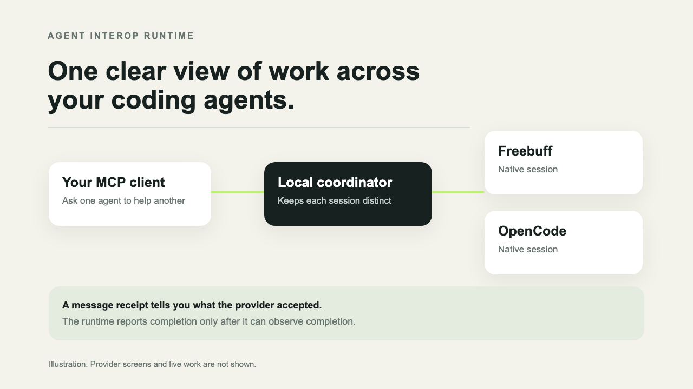
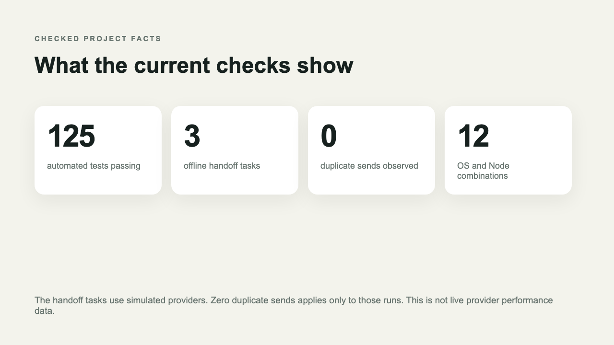

# Agent Interop Runtime

Your coding agents already know how to work. This project helps them share a task without pretending they are the same agent.

Connect a local MCP client to Agent Interop Runtime. The runtime finds coding agents on your computer. Choose a session, send it work, follow its progress, then pass a result to another session. Each provider keeps its own account. Its permissions, history, workspace access stay separate.

Think of it as a traffic desk used by coding agents. It shows who received a task. It records provider updates. It keeps the result of each check. It does not create one shared chat behind the scenes.



[Watch the short illustrated tour](docs/media/agent-interop.mp4)



The pictures are illustrations. They do not show a live provider session.

## What happens when you send work

The runtime sends your message to the selected provider session. A receipt can say that the provider accepted the message. That receipt does not say the agent finished the task. The runtime reports completion only when it observes a result.

The same rule applies to uncertain delivery. A network failure can happen after a provider accepted your message. The runtime will mark that result as unknown. It will not silently send the prompt again.

## What it can do

Find supported provider sessions on your computer.

Create sessions when supported. Resume them when supported.

Send work, request cancellation, read progress, collect a provider diff when supported.

Keep shared work notes, handoffs, evidence, reviews plus cooperative resource claims.

Run local checks inside a named workspace when you explicitly enable verification.

Read small text files inside an approved project folder. Common credential files are blocked. Credential shaped text is redacted. Binary files are refused.

Provider features differ. The doctor report shows what an installed provider can do. Discovery alone leaves sign in status plus task readiness unknown.

## What it does not do

It does not merge provider accounts with provider histories.

It does not bypass a login, consent prompt, permission request.

It does not give an agent access to a provider that is not installed on your computer.

It does not sandbox commands. Verification runs commands you configure. Use it only with trusted work.

Resource claims coordinate agents that use this runtime. They cannot stop another program from editing the same files.

## Providers

Freebuff Desktop uses its local app connection. Writes require a current launch check. Freebuff CLI uses a managed terminal session.

OpenCode uses its local server. The runtime may start a server on loopback when needed. Requests that may change work are never replayed after an uncertain network result. A session remains tied to the server that exposed it.

Codex uses the Codex app server. Claude Code plus Cursor use their supported Agent Client Protocol commands.

The feature list depends on the provider version, local setup plus account state. Most protocol checks use simulated providers. Check live use on the target computer.

## Current evidence

The repository test suite passes 125 checks. The offline benchmark ran three simulated handoff tasks. It observed zero duplicate provider sends in those runs. It does not contact live agents. It does not measure speed. It does not estimate provider cost.

GitHub CI pairs three operating systems with four supported Node versions. That yields twelve combinations.

Earlier local checks observed a Freebuff GLM 5.3 Flash response. OpenCode Big Pickle accepted a prompt, while completion was not observed. These results apply only to those sessions. They do not establish general provider support.

## Install

Use Node 20 through Node 26. Install the released package with pnpm.

```sh
pnpm add --global agent-interop-runtime
agent-interop-runtime doctor
```

The latest published npm version is 0.3.2. The source fixes described here are in the repository. Use the repository build to try them before a newer package release is published.

```sh
git clone https://github.com/Praket7/agent-interop-runtime.git
cd agent-interop-runtime
pnpm install
pnpm build
node dist/src/cli.js doctor
```

## Connect a local MCP client

Run the installer to inspect the local Codex entry. Use its write option to update it.

```sh
node dist/src/cli.js install
node dist/src/cli.js install --write
```

The write option backs up the current file. It preserves unrelated settings. Restart Codex after changing its configuration. npm installation alone does not edit your settings.

Other MCP clients can launch the same `serve` command through their local server configuration. Keep this connection on your own computer unless you have deliberately set up authenticated remote access.

## Choose a smaller tool set

The full profile exposes every available tool. Agents may find a smaller profile easier to use.

```text
INTEROP_TOOLS_PROFILE=minimal
INTEROP_TOOLS_PROFILE=core
INTEROP_TOOLS_PROFILE=freebuff
INTEROP_TOOLS_PROFILE=legacy
INTEROP_TOOLS_PROFILE=full
```

The minimal profile focuses on provider sessions. Core adds shared work records. Freebuff exposes Freebuff specific controls. Legacy combines core with older Freebuff tools. Full is the default. Read only mode is available with `INTEROP_READ_ONLY=1`.

## Run checks

```sh
pnpm typecheck
pnpm test
pnpm lint
pnpm mcp:validate
pnpm bench:check
pnpm pack:check
```

Read [the provider guide](docs/adapters.md), [the plain language architecture guide](docs/architecture.md), [the compatibility notes](docs/compatibility.md), plus [troubleshooting](docs/troubleshooting.md).

## Safety, privacy

The local stdio server is the simplest setup. HTTP mode binds to loopback by default. It requires a bearer token. Remote access requires an explicit setting plus network protection. Session identifiers do not replace authentication.

Project file reads stay inside the selected project folder. Common credential files are denied. Text undergoes checks against common credential patterns. This cannot detect every secret. Keep sensitive values out of files an agent can read.

Verification is off by default. When enabled, it runs configured programs without a shell. It checks that the working folder stays inside the named workspace. Child programs are not sandboxed.

## Help improve it

Use `doctor` before sending work. Report the provider name, version, operating system. Describe the action you tried. State acceptance status. State completion status. Leave private prompts, credentials out of reports.

The project welcomes reproducible compatibility reports plus code contributions.
