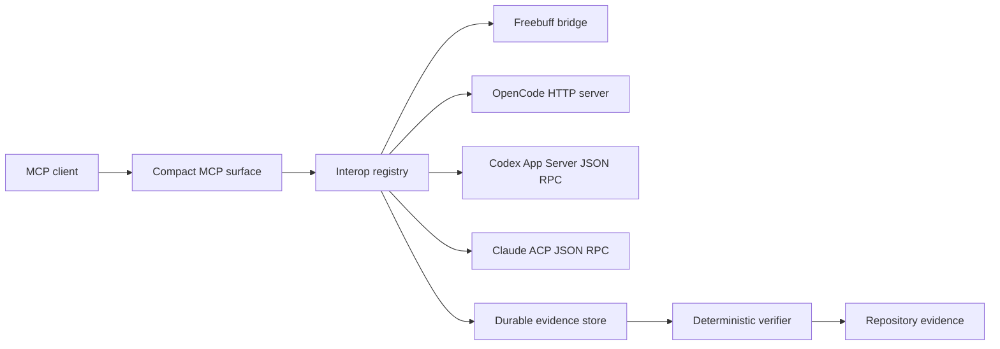

# Architecture

Agent Interop Runtime has four layers.

The provider layer speaks to native systems. Freebuff uses the preserved Desktop and managed PTY bridge. OpenCode uses its local HTTP server. Codex uses its App Server JSON RPC transport. Claude Code uses ACP over JSON RPC when the ACP command is available.

The normalized layer preserves native identity while adding a global provider label. A global identifier never replaces a provider native identifier.

The workflow layer stores work, evidence, handoffs, reviews, and verification results. State is persisted atomically in the user application data directory. A custom path can be selected with `INTEROP_STATE_FILE`.

The MCP layer exposes compact discovery, control, observation, coordination, evidence, and permission tools. Unsupported operations fail clearly and are never emulated with terminal keystrokes.

Evidence has explicit trust levels. Agent claims are weaker than provider observations. Runtime command results and direct repository inspection are recorded separately. The runtime never promotes one trust level silently.

## Recovery behavior

Provider sessions retain their native identifiers. Native event streams are live observations and are not falsely replayed after a process restart. Durable work and evidence are written with a temporary file and rename so a process interruption cannot leave a partially written state file.

## Authority boundaries

Reviewers receive evidence and may return findings. A reviewer does not gain write access to the subject session through a review request. Remediation is sent to the exact originating session only when the caller explicitly chooses that native session.
