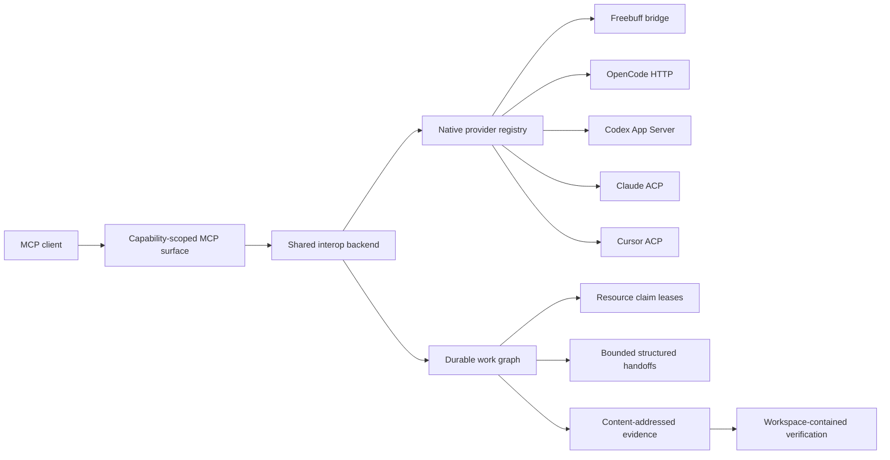

# Architecture

Agent Interop Runtime is a local coordination and reliability layer above native coding-agent transports. It preserves provider identity instead of pretending heterogeneous sessions are one generic transcript.

## Provider and session identity

Every session retains its provider-native identifier. The normalized identifier adds a provider namespace but never substitutes it when calling a provider. Capability probes degrade per provider so one unavailable adapter does not erase healthy sessions.

HTTP MCP protocol sessions share one process-wide backend. Provider processes, event subscriptions, workflow state, and conversation state therefore remain coherent across multiple connected clients.

## Durable coordination

The workflow store contains work items, dependency edges, evidence, reviews, handoffs, verification results, and resource claims. File-backed mutations use an inter-process lock and atomic replacement. Read paths refresh from disk so long-lived processes see writes made by peers.

Resource claims are leases over files, directories, interfaces, or workspaces. The runtime atomically rejects conflicting exclusive claims. They are coordination primitives, not an operating-system filesystem sandbox: a provider that writes outside the Agent Interop protocol can still violate a claim.

## Handoffs and evidence

Handoffs preserve objective, acceptance criteria, and authority boundaries as mandatory fields. Optional continuation state, validation evidence, assumptions, rollback notes, changed files, risks, next action, evidence references, and repository revision are packed under the configured token budget with explicit omission records.

Evidence is addressable by ID and includes a SHA-256 content hash. Trust levels distinguish caller claims, provider observations, runtime observations, repository verification, and human acceptance. Review requests carry bounded handoff packets plus evidence references instead of embedding unbounded diffs.

The handoff lifecycle is explicit: `created → accepted → applied → verified → completed`, with `blocked` and `superseded` escape states.

## Delivery and recovery

Conversation messages are persisted before provider dispatch. Caller idempotency keys are checked inside the same locked transaction that creates a message. A durable dispatch lease is renewed while the provider call is active; another process will not classify a live leased message as interrupted. Unknown delivery outcomes are never blindly resent.

Native event streams use a shared per-session pump. A terminated provider iterator closes its buffer so a later read opens a new subscription. `events_page` overlays a registry-owned monotonic cursor and reconnect epoch, avoiding provider sequence resets.

## Verification and authority

Verification is disabled unless `INTEROP_ALLOW_VERIFICATION=1`. Checks run without a shell, inside an explicit or provider-verified workspace; command-specific working directories cannot escape that root and credential-shaped environment variables are removed.

String `authorityBoundaries` in a handoff remain explicit continuation constraints, not a claim that every provider action is intercepted. Resource claims are the first machine-enforced coordination boundary. Provider-native permissions remain provider/user controlled.
